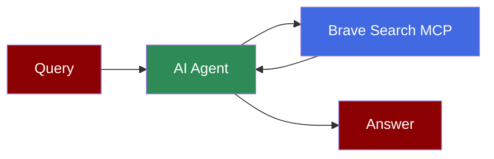

## Add Brave Search Tool to AI Agent



## Quick Start

<Steps>
    <Step title="Install Dependencies">
        Make sure you have Node.js installed, as the MCP server requires it:
        ```bash
        pip install praisonaiagents mcp
        ```
    </Step>
    <Step title="Set API Key">
        Set your Brave Search API key as an environment variable in your terminal:
        ```bash
        export BRAVE_API_KEY=your_brave_api_key_here
        export OPENAI_API_KEY=your_openai_api_key_here
        ```
        
        You can obtain a Brave Search API key from [Brave Search API](https://brave.com/search/api/).
    </Step>

    <Step title="Create a file">
        Create a new file `brave_search.py` with the following code:
        ```python
        from praisonaiagents import Agent, MCP
        import os

        # Use the API key from environment or set it directly
        brave_api_key = os.getenv("BRAVE_API_KEY") or "your_brave_api_key_here"

        # Use a single string command with environment variables
        search_agent = Agent(
            instructions="""You are a helpful assistant that can search the web for information.
            Use the available tools when relevant to answer user questions.""",
            llm="gpt-4o-mini",
            tools=MCP("npx -y @modelcontextprotocol/server-brave-search", env={"BRAVE_API_KEY": brave_api_key})
        )

        search_agent.start("Search more information about AI News")
        ```
    </Step>

    <Step title="Run the Agent">
        Execute your script:
        ```bash
        python brave_search.py
        ```
    </Step>
</Steps>

<Note>
  **Requirements**
  - Python 3.10 or higher
  - Node.js installed on your system
  - Brave Search API key
  - OpenAI API key (for the agent's LLM)
</Note>
